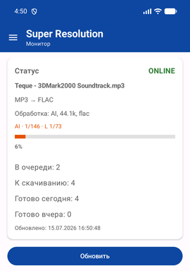
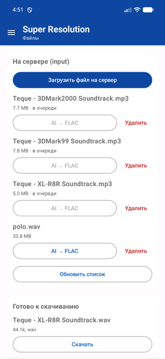
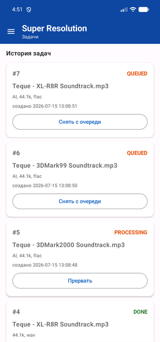
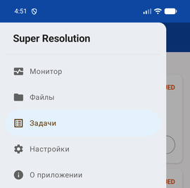

# SR Monitor (super-resolution-android)

Android-приложение для мониторинга и управления очередью обработки аудио на сервере [super-resolution](https://gitverse.ru/Max_Cherep/super-resolution).

Показывает статус worker, текущую задачу и прогресс, историю задач, загрузку/скачивание файлов. При завершении всех задач — уведомление со звуком (если включено).

### Монитор



### Файлы



### Задачи



### Меню



## Возможности

- **Монитор** — ONLINE/OFFLINE, текущая задача с прогрессом, очередь, готово сегодня/вчера (по TZ телефона), файлы к скачиванию
- **Файлы** — загрузка на сервер, AI → FLAC, скачивание готовых, удаление из input
- **Задачи** — история, статусы, прерывание / снятие с очереди
- **Настройки** — адрес сервера, порт, логин/пароль, уведомления
- **Тема** — светлая / тёмная

## Быстрый старт

### Требования

- Android 7.0+ (API 24)
- Сервер super-resolution в той же локальной сети (Wi‑Fi)
- Android Studio (для сборки) или готовый APK

### Сборка

```bash
git clone git@gitverse.ru:Max_Cherep/super-resolution-android.git
cd super-resolution-android
# Укажите путь к SDK в local.properties: sdk.dir=/path/to/Android/Sdk
./gradlew assembleDebug
# или release (подпись debug-ключом для личного использования):
./gradlew assembleRelease
```

APK: `app/build/outputs/apk/debug/app-debug.apk` или `app/build/outputs/apk/release/app-release.apk`

### Установка на телефон

```bash
adb install -r app/build/outputs/apk/debug/app-debug.apk
```

Или скопируйте APK на устройство и установите вручную.

### Первый запуск

1. Укажите **адрес сервера** (IP или hostname) и порт `8080`.
2. Если на сервере задан `APP_PASSWORD` — логин `admin` и пароль.
3. Нажмите **Обновить**.
4. Для фонового мониторинга включите **Уведомления при завершении** и разрешите их в Android.

Фоновый мониторинг работает только при включённых уведомлениях. Остановка: выключить переключатель или смахнуть приложение из списка недавних.

## API

```
GET http://<host>:8080/api/mobile-status?tz=<IANA>
```

Авторизация: HTTP Basic (если на сервере задан пароль).

| Поле | Смысл |
|------|--------|
| `queue_size` | задач в очереди |
| `workers_busy` | worker занят (0/1) |
| `workers_total` | consumer в RabbitMQ |
| `tasks_completed_today` | готово за сегодня (локальный день по `tz`) |
| `tasks_completed_yesterday` | готово за вчера |
| `ready_downloads` | готово к скачиванию |
| `current_job` | текущая задача (имя, прогресс, фильтры) |

Также: `GET /api/jobs`, `POST /api/jobs/{id}/cancel`, input/upload/download endpoints.

## Документация

- [PROJECT_PLAN.md](PROJECT_PLAN.md) — план разработки, этапы, чек-листы
- [CONTRIBUTING](.gitverse/CONTRIBUTING.md) — как вносить изменения
- [SECURITY](.gitverse/SECURITY.md) — сообщения об уязвимостях

## Лицензия

[MIT](LICENSE)

## Автор

© [@MaxCherepanov](https://gitverse.ru/Max_Cherep)
